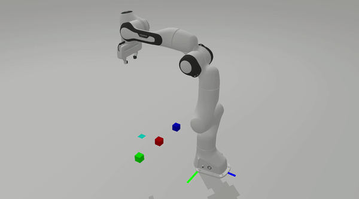

# Course Project for CSE291

## Requirements
* python 3.7
* sapien
* numpy
* opencv-python
* ikfast-pybind

```
pip3 install -r requirements.txt  --user
```

## Content
* Hand-eye calibration: refer to [homework1](hw1/README.md). 
* Simple PID controller: refer to [homework2](hw2/README.md).
* Pick and Place Boxes using Robot Arms with Spades: refer to [final project](final_project/README.md) and the [project report](CSE291G_report.pdf).




